# Shanna's Blog :tulip: #
[week 11](README.md#week-11)\
[week 10](README.md#week-10)\
[week 9](README.md#week-9)\
[week 8](README.md#week-8)\
[week 7](README.md#week-7)\
[week 6](README.md#week-6)\
[week 5](README.md#week-5)\
[week 4](README.md#week-4)\
[week 3](README.md#week-3)\
[week 2](README.md#week-2)\
[week 1](README.md#week-1)

# Week 11 #

## :pushpin: 11/14/2024 
Submitted my report for Project 3 this week! It was really interesting, and especially because it was such a quick and short project, I think I'm going to be using ZeroWidth for my final project, Project 4. Especially because I'm currently learning a lot about UX Research Operations in my internship, I've been seeing a common pain point when it comes to storing and managing research repositories. It's especially hard to search through the data afterwards, because most of the insights are written out in google docs that aren't readable in Airtable or Google Sheets. After talking with my manager, she said that she imagines a future where researchers (and other stakeholders, including PMs, managers, designers, etc.) can ask a Research Repository chatbot a question about any of the research they've conducted over the years and the chatbot will supply them with relevant insights and information. 
Buiding this out with ZeroWidth, along with a UI in Figma, would be my goal for the final project. I'd like to include user interviews and testing to may iterative improvements along the way. 

## :key: Key Learnings
Some thoughts and takeaways I've had based on feedback on my presentation last week, as well as my thoughts on using ZeroWidth generally. 
1. Integrating ZeroWidth Can Address Data Management Pain Points: Leveraging ZeroWidth for efficient data storage and retrieval could offer a practical solution for managing research repositories, enabling stakeholders to quickly locate relevant insights.
2. Cross-Departmental Accessibility to Research Data is a Common Need: Creating a research repository chatbot accessible to various stakeholders (researchers, PMs, designers) can address common accessibility issues and improve cross-functional collaboration.
3. Experimentation with Retrieval Augmented Generation Improves Precision: Testing different Retrieval Augmented Generation configurations provides insights into fine-tuning responses for greater relevance and accuracy, which is particularly beneficial for handling diverse user queries.

## :telescope: Speculations
For my research repository chatbot, I envision a tool that centralizes knowledge-sharing, making it easy for cross-functional teams to access insights and make data-informed decisions faster. By streamlining data retrieval, the chatbot could cut down on redundant studies and allow longitudinal tracking of trends. I also see potential for role-specific summaries and adaptive responses based on common queries, enhancing relevance for each stakeholder. Privacy and access control will be prioritized, with potential integrations into project management tools to embed insights within workflows. Ultimately, I want the chatbot to highlight actionable insights, helping teams turn data into meaningful actions.

# Week 10 #

## :pushpin: 11/07/2024 
Here is the video I made for the final version of Shannabot, my AI agent that you can ask any question about my experience during TDF. She is a little bit sassy, and very playful- and outputs formatted outputs for easy reading and understanding. 

 📹 (Click to watch the video)

## :key: Key Learnings
1. Clear Instructions and Context Improve Accuracy: Providing the AI with direct instructions and relevant variables like location and year helps it generate more precise and context-aware responses.
2. Chunking Knowledge Boosts Retrieval: Organizing information into smaller, focused chunks enhances the AI’s ability to pull accurate details from the knowledge base, although this requires careful setup.
3. Combining Techniques Yields the Best Results: Integrating model settings, instructions, RAG, and variables creates a well-rounded, accurate chatbot capable of delivering detailed responses aligned with user needs.

## :telescope: Speculations
As AI agents become integrated into our daily lives, especially in the workplace, I see a world where companies are able to shift their focus to innovation/ ideation, rather than the menial every-day tasks that can now be automated. The way we make things will definitely change- AI will be a tool that helps democratize many “making” processes. It already has made coding more accessible, and as we see generative tools expand into other fields (3D modeling, UI), more people will be able to make more complex things! It will be interesting to see AI being used to train other AIs. We might start expecting AI systems to be more self-sustaining, meaning they would require less direct human oversight over time.

# Week 9 #

## :pushpin: 10/31/2024 🎃
This week, I worked on the experiments TJ posted tutorials to for Zerowidth. Here are the links to the specific tutorials I did:

1. [Shanna GPT Experiment 01 Demo](https://zerowidth.ai/c/demo/sLdipFF8KUjgXXo0JMda/draft)
2. [Shanna GPT+INSTRUCT Experiment 01](https://zerowidth.ai/c/demo/mTKGtpccfjLKS6O79ATd/draft)
3. [Shanna GPT+INSTRUCT+RAG Experiment 01](https://zerowidth.ai/c/demo/9i1ydXpmjZ67alSCdaj1/draft)
4. [Shanna GPT+INSTRUCT+RAG+VARIABLE Experiment 01](https://zerowidth.ai/c/demo/XvTeK9hB4XWqJdui7xpO/draft)

Generally, I found that I had to play around with chunking and similarity thresholds a bit in order to get the information to come as accurate. One thing I might consider doing for my final iteration is combing through and chunking the data meaningfully myself first, maybe separating by week, in a spreadsheet so that it's easy for me to export as csv and then load in. Hopefully, this will help the LLM along in processing and recalling the information. It kept making up information for specific topics as I asked more granular questions:

These were flat-out wrong, even though the answers are clearly stated in my repository. I'm going to have to continue working on this. Furthermore, the variables experiment is where I got a bit confused. I'm going to keep looking into this over the weekend. But, while the dates are very relevant to the information I'm trying to query, it doesn't show up correctly. I want to experiment with embedding techniques that prioritize context around dates and themes. I could try structuring data by week or by theme (e.g., “Projects,” “Applications,” “Experiments”). 

## :key: Key Learnings

1. Meaningful Data Chunking Matters: Organizing data into meaningful chunks (e.g., by week) improves the model's ability to retrieve specific information accurately.
2. Similarity Thresholds Need Adjustment: Playing with similarity thresholds is crucial; setting them too high or too low can lead to inaccurate or fabricated responses.
3. LLMs Can Fabricate Information: This was pretty surprising and weird... Despite clear data, LLMs may generate incorrect responses. Structuring data effectively and being clear in prompts can reduce this.

## :telescope: Speculations
Organizing data by week or theme could improve the model's accuracy by helping it prioritize context and retrieve information more precisely. Adapting similarity thresholds based on query complexity may also enhance responses, with higher thresholds for simple questions and more flexibility for open-ended ones. Adding a date-specific pre-processing layer might solve issues with incorrect dates by matching questions to the most relevant timeframes. Overall, these adjustments could create a model that feels more intuitive and aligned with natural memory processes.

# Week 8 #

## :pushpin: 10/24/2024
This week, everything came together for our project. The details of our process + fabrication journey is in our presentation video! We have also included takeaways and speculations.

 
📹 (Click to watch the video)

# Week 7 #

## :pushpin: 10/17/2024
Since last class, we updated our project proposal with a corrected System Architecture based on feedback from Sudhu. We will have to be using 2 separate photons to communicate between one another- one will be used to collect the information on the button press and then send information through the cloud to the other photon that is inside the penguin toy, in order to turn on the LED that indicates to the reciever that they have a "gift" waiting for them. Here's the updated system:

<kbd></kbd>

My experiments throughout the weekend and during the week pertained to connecting the proximity sensor to the servo, and having it move depending on the user's proximity to the sensor. I got it to work quite well with a 250 millisecond delay. Here is the video:

 
📹 (Click to watch the video)

After meeting with Sudhu, we decided to play around with the delay, and made it a lot smaller, which got the proximity sensor working really well + accurately, but seemed to be overwhelming the servo with information. It ended up being static once we changed this code. So I had to keep playing around with it. It was just generally pretty spotty, and we wanted our users' experience to be consistent. So, we were debating using an Ultrasonic sensor instead, even though it's technically not a STEMMA QT piece. 
Latest update as of last night- Kaden ended up doing some parallel experiments on his end, and found that the proximity sensor had a lot less problems and was more compatible with the servo. Here is a video of the servo working pretty well! Right now, it rotates 90 degrees if the user is within 5cm and 10 cm, and rotates 180 degrees when the user is less than 5 cm from the sensor. 

 
📹 (Click to watch the video)

## :key: Key Learnings

1. Iteration based on feedback: After meeting with Sudhu, we made important adjustments to our project proposal, particularly the system architecture. We realized that using two separate Photon microcontrollers to communicate via the cloud is crucial to ensuring smooth interaction between the button press and the LED in the penguin toy. This feedback really helped us clarify the technical approach and improved our design moving forward.

2. Changing sensors to generate output more effectively: I spent a lot of time experimenting with connecting the proximity sensor to the servo and adjusting the delay to get more consistent results. While initial adjustments caused the servo to become static, we were able to improve the performance through more testing. My teammate Kaden also had success on his end, showing that the proximity sensor could still work well, which was a relief and allowed us to refine the system further.

## :telescope: Speculations
I think our project will have its ups and downs as we fine-tune the technical aspects, particularly with the communication between the two Photon microcontrollers. While we’ve already run into some challenges, like getting the proximity sensor and servo to work smoothly together, I’m optimistic that with more testing and adjustments, we’ll be able to create a reliable and engaging system. There will likely be some unexpected obstacles, but I believe we’ll overcome them by collaborating and troubleshooting together. I’m excited to see how the project comes together and feel confident that we’ll have a working prototype that captures the essence of "penguin pebbling" by next week! So far, we are learning a lot, and that's really what matters!

# Week 6 #

## :pushpin: 10/10/2024
Over the weekend, we had to solder our sparkfun board and experiment with some tutorials. I had never soldered before, so this was a cool new experience. To be honest, I was really nervous at first. I was afraid I would damage something and render it unusable. When I got to the studio, no one was there yet, so I watched a video tutorial. I ended up asking two students from Cohort 4 to help me solder since it was my first time. They were really nice to help me out. It turned out a bit messy, but I made sure none of the pins were connected. One thing I realized was that the point I used at the beginning was too big. It was not precise enough. If I were to redo this process, I would've made the temperature higher too. The silver kept hardening really quickly. Here's a picture of how it turned out:

<kbd>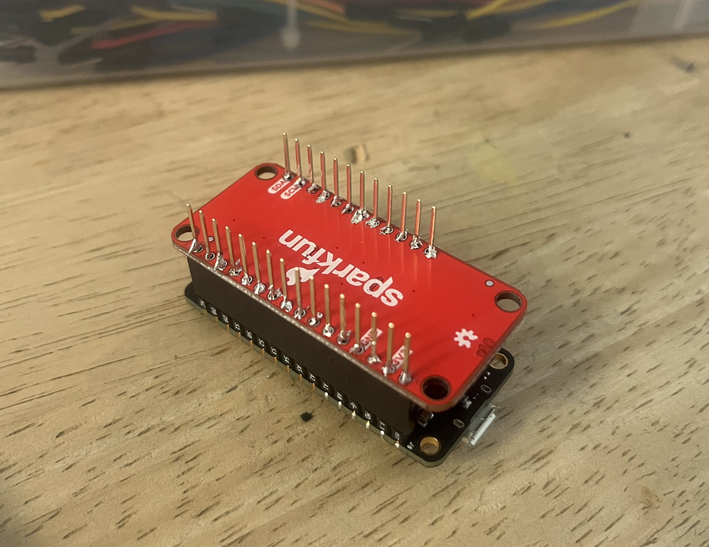 </kbd>

I ended up trying the ambient light sensor tutorial with the APDS9960. Here are some videos I took of how it turned out. 

 
📹 (Click to watch the video)
 
📹 (Click to watch the video)

I also worked with my group on coming up with a project proposal for Project 2. Here's what we decided on: "Inspired by the natural behavior of "penguin pebbling," the system allows a sender to trigger an interaction that alerts the receiver of a gift. This feasibility study explores how Particle Photon 2 can facilitate meaningful, non-physical expressions of affection, offering an engaging alternative to in-person interactions, particularly for individuals who struggle with physical displays of affection. The final deliverable will be a functional prototype demonstrating this concept". I made a diagram of what the system would look like:

<kbd></kbd>

I'm excited to get started on this project with my teammates. 

## :key: Key Learnings

1. Conquering my first soldering experience: I was really nervous going into my first soldering attempt, but with the help of two students from Cohort 4, I was able to get through it successfully. It was messy, but functional, and I learned a lot about using the right tip size and adjusting the temperature to get better results. Now I feel much more confident in my soldering abilities!

2. Making great progress on Project 2: My team and I finalized our proposal for Project 2, which focuses on creating a system inspired by "penguin pebbling" using the Particle Photon 2. The idea is to allow people to send remote interactions to loved ones, mimicking the affectionate behavior of penguins. I'm really excited about how this concept is coming together, and I can’t wait to start prototyping!

## :telescope: Speculations
I think systems like the one we’re working on could really transform how people express affection and stay connected across distances. This technology could evolve into more sophisticated forms of remote communication, especially for those who struggle with physical displays of affection. It could even expand into healthcare, allowing loved ones to send supportive messages to patients, or be used in long-distance relationships where people can share intimate moments or gifts in real time. Imagine a future where meaningful interactions are sent with just the touch of a button, no matter how far apart people are. This idea could even be commercialized as a product for various emotional communication platforms, turning something as simple as a gift notification into a widely adopted form of digital affection.

# Week 5 #

## :pushpin: 10/03/2024
Here are some of the tutorials that I completed this week. It was supper gratifying to see them work and come together! I got to apply the vocabulary from the glossary and from what I learned from my classmates in an application of the tool. 

### Button -> LED Pulse Rate
 
📹 (Click to watch the video)

<kbd>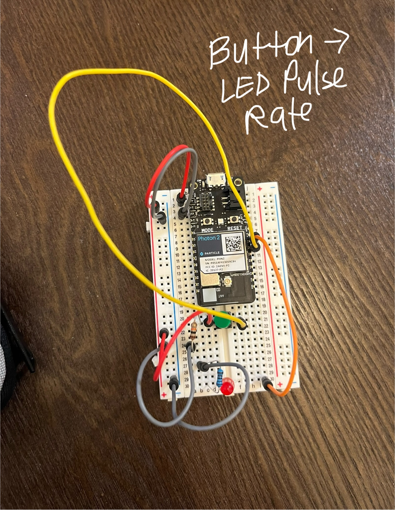 </kbd>

### Button Send on Change
 
📹 (Click to watch the video)

<kbd>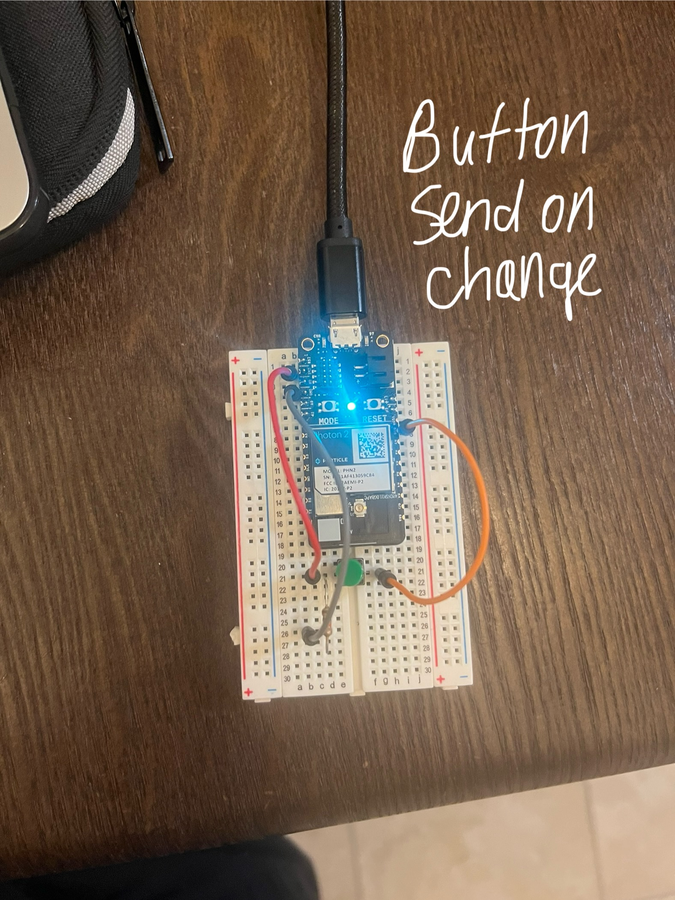 </kbd>

### FSR -> LED Color
 
📹 (Click to watch the video)

<kbd>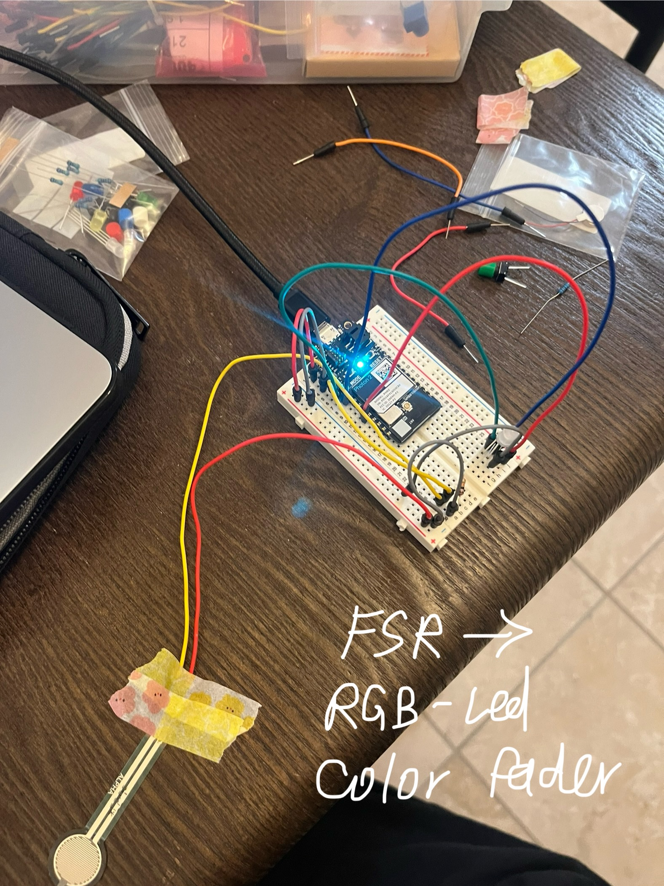 </kbd>

These projects are a bit different from what we've already encountered because they involve a larger ecosystem, bringing in more hardware parts to turn input into output. In some cases, the range of input it takes in is wider than in the past. For example, the FSR- it takes in a range of pressures that are non-discrete, and changes the color value of the LED. The button, however, only takes in a binary input- is it pressed or not?

### How might the demonstrations be expanded to include a new feature? 
I would be curious to see an example with a temperature sensor. Especially now that the temperature is varying a lot, it would be interesting to see how tracking a change in temperature as input might be able to be output in a way that makes sense to users- maybe a change in color? Or a sound? A relevant application of this for me, would be to tell when the stove is heated up enough for me to start cooking on it. It takes a while for the pan to heat up, and to heat up the oil to a point where I can start cooking. However, I often wait too long and the oil gets burnt or too hot. It would be cool to see an application of these sensors that could help with this problem. 

### How might Machine Learning play a role in the system you are imagining? 
Machine Learning (ML) could enhance this system by learning from patterns in cooking behavior and stove usage. For example, over time, the system could use historical temperature data and cooking outcomes to predict optimal heating times based on specific cooking styles or recipes. ML could also be used to identify when certain ingredients, such as oil or food, are added to the pan, adjusting the heat level recommendations dynamically. With more data, the system could provide personalized recommendations on when to start cooking based on how long the stove typically takes to heat for different types of pans or heat settings.

### Can you imagine the examples being combined into a larger ecosystem?
In a larger smart kitchen ecosystem, temperature sensors could work alongside smart cookware, appliances, and AI-powered recipe assistants to create a seamless cooking experience. The system would track stove or pan temperature, alerting you when it’s ideal to start cooking via color changes or sound. Integrated machine learning would adapt to your preferences, automatically adjusting heat levels based on past cooking sessions, while ingredient recognition and recipe suggestions streamline the process. Safety features like auto shut-off and real-time monitoring ensure a hassle-free and efficient kitchen, where everything works together to deliver perfect results every time.

## :pushpin: 09/30/2024 

For Monday, we had to play around with the example files. I was able to flash three of them to the Photon 2, including 02_helloworld_spell, 04_make_it_blink, and 03_altering_periodicity. This was a bit challenging at first because I had to remember the steps we had done in class, but I ended up meeting with some classmates and they helped remind me of some of the steps I forgot. For example, being able to see output using the Serial Monitor- which I didn't remember to do on my own. Check out some of the videos I made while flashing these down below! 

 
 
 

Overall, it was cool to see! I still don't entirely understand how the pattern of blinking relates to some of the content in the code, but I will investigate that further in the coming week. 

### Playing with variables
I played around with the delay time, as well as other variables, to see the effect on the Photon. Some were only noticeable to me in the output terminal. For example, I tried to make a for loop to print something a couple of times. This was an interesting edit- the result was the word "boing" repeated based on the number of times I specified in the for loop. I played around with different numbers to see how it affected the output as well. The beginning number I set in "i=0" was the beginning of the loop, I found, and the "i<" or "<=" was the upper limit of the loop. So for example, if I were to start at 
The delay amount I chose affected how long the program paused for. And where I put it in the program impacted when it paused throughout the duration of the flash. So, the higher the number I put in delay time, the longer it paused. I also tried this code I found on Google. The HIGH and LOW signal seem to turn the LED off and on. I tried changing the value in "int led = D7" to other combinations, and this seemed to change where on the breadboard it would light up. 

<kbd>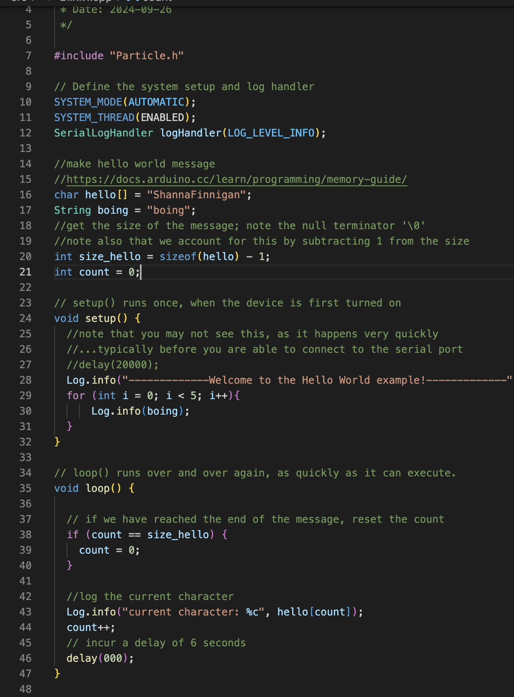</kbd> <kbd><kbd>

### How do these elements work together?

The Particle ecosystem integrates both hardware- the Photon 2, and software- on Particle Workbench, which we access through VS Code, and cloud services to form an IoT platform. The Workbench works as the environment for coding and testing, and the devices communicate through the cloud.  The wires and buttons that come in the kit work as an interface that connects the user/ a person to the system, allowing them to interact with it and make stuff "happen", or impact the feedback. 

### Entry Points
🛠️ **Hardware:** Photon 2 microcontroller + sensors provided in the kit\
💻 **Workbench:** Environment for writing and testing code\
:cloud: **Particle Cloud:** APIs and Console for managing and controlling devices

### Advantages?
I don't have experience with any other microcontroller systems, so unfortunately I can't make a direct comparison. But I have some observations of what I think could be seen as advantages, and researched a bit online. It seems like the Particle ecosystem is beneficial because it brings everything together in one place- hardware, cloud, and software—all working together in a system seamlessly. Based on what we talked about in class, it seems like the ability to easily scale up if you're managing a bunch of IoT devices is a perk compared to Arduino.

### What kinds of ecosystems are missing in your daily life?
:notebook: **Personal Productivity:** I have really been trying to work on increasing my productivity, especially having to balance school with work. I find that the best way for me to keep track of everything ends up being analog in a notebook because The systems for taking notes on tasks, accessing assignments, tracking their progress, and managing timelines is a bit disjointed. It especially feels like there's no automation where I need it. I would like to use a more comprehensive product (maybe airtable? or notion?) to keep track of everything in one place.\
🍎 **Groceries:** I would really benefit from a more systematic approach to the way I shop for groceries and keep track of the expiration dates of food items, what I need to use up first and what I can wait longer to eat. It's a lot to keep track of in my brain. Additionally, there's the fact that some of the groceries are shared between myself and my roommate. I would be curious to see if there are systems out there that allow you to track the freshness of your food, integrate it with a grocery list builder, and a recipe generator, to help reduce food waste and create a more cohesive ecosystem out of it all. 

# Week 4 #
## :pushpin: 09/26/2024

This week, we started thinking about Project 2: "Build a Digital EcoSystem". We are continuing to learn about systems design, but now will go deeper into it, looking at how entire ecosystems work together. I took notes during Tuesday's lecture. I've used ChatGPT to help me put these bullet points together into full sentences. A digital ecosystem consists of several key components that work together to create interactive systems. In the case of the Photon2 microcontroller, it serves as "the brain" of these systems, managing the flow of information between various hardware components like sensors, LEDs, and actuators via firmware code, which acts as the operating system. Electronics, often assembled on breadboards, form the foundation, with discrete components interacting to send data across the ecosystem, often via web-based APIs. These APIs allow programmers to interface with the system, accessing key functions and data points.

We also discussed HCI. Human-Computer Interaction focuses on how users engage with computers. The process begins with human senses perceiving information, which is then processed by hardware and software. Effective HCI design ensures a seamless connection between human input and digital feedback, enhancing user experience. In physical computing, interactive systems rely on sensors and actuators to bridge the digital and physical worlds. Sensors collect data from the environment, while actuators—such as LEDs, speakers, or robotic components—output responses in the form of signals or physical manipulations. This dynamic interaction is key to creating responsive, real-world applications.
This will be my first time working with microcontrollers. Microcontrollers, like the Photon2, are small computers designed to manage inputs and outputs through their pins, facilitating the processing of data. Input is processed and converted to output in a cycle that powers a wide variety of applications, from simple LED indicators to complex robotic systems.

To begin understanding how to visualize ecosystems and how components work together, we were given an assignment to map an interaction ecosystem. I chose to map the way that my compost fits into the larger system in Berkeley. 

<kbd>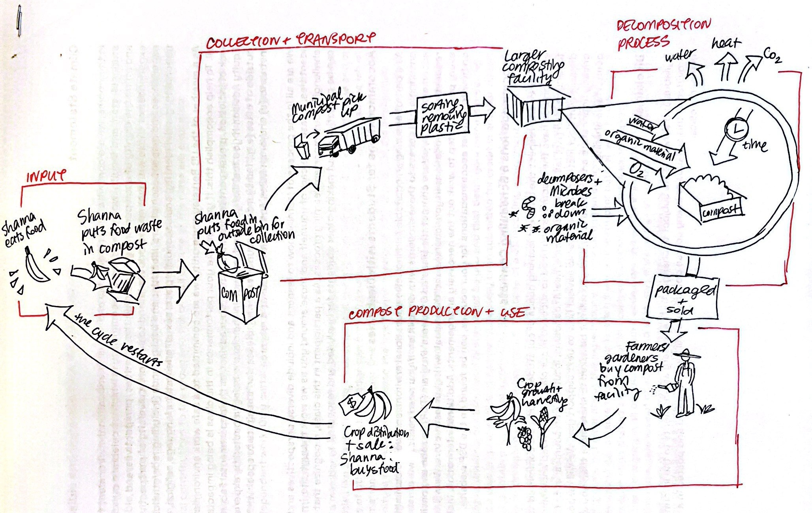</kbd>

## :key: Key Learnings 
I learned a lot of new terminology this week regarding digital ecosystems. This, paired with the mapping exercise, created some main takeaways for the week:
1. HCI encapsulates the deep relationship between human perception and digital feedback, where users’ actions shape a system’s response. 
2. A digital ecosystem can be viewed as a living network of interconnected elements, each playing a specific role within a larger system- this can be replicated in systems that exist in the natural world, like the subsystem of decomposition that I mentioned in my diagram. 

## :telescope: Speculations
Based on these learnings, I speculate that our Project 2 will be focused (and graded on) building an integrated digital ecosystem that responds dynamically to both human input and environmental data. I anticipate learning to work with microcontrollers like the Photon2 to manage complex interactions between hardware components—sensors, actuators, and APIs—creating a seamless flow of information. Because this is something new to me, I'm sure it will be challenging at first, but hopefully, with the help of my cohort mates, I'll be able to perservere and learn some cool new stuff!

# Week 3 #
## :pushpin: 09/19/2024

This week, Project 1 was due! I took my experimentations and continued building upon them. I am interning full-time and had a busy so it was essential that I plan in time accordingly to work on this project, so I made sure to finish it before class on Monday so I could continue adding to it- however, I must've saved wrong and all my progress was lost! :( It was very overwhelming because I knew I had limited time to work on it. But, this is when I felt most supported by my cohort-mates! After expressing my frustrations, I was able to rebuild where I left off, and with the help of my classmates and the Design Specialists, get my project finished and printed in time!

:arrow_forward: [Link to my Project 1 Video](https://youtu.be/ngysztLlCo8)

## :key: Key Learnings 
My experimentation started with trying to replace certain parts of the system and scaling/ playing with sliders, and eventually I added in a system of my own and plugged it into what already existed in the file. 
Overall, this was a new experience for me, because I’m a very visual person and am not used to seeing visual information displayed as a system in this way, but it was a very helpful exercise to see how I could make products that could be easily manipulated and tested. I took away a couple of main things:
1. You can't do everything all the time. There will be set-backs. This is the time to lean on your peers! To open up and ask for help- there's nothing wrong with not knowing where to pick up again.
2. It's all about the process, not the end result. I feel like I learned so much more from experimenting and struggling with the software than when it all came together in the end. 

## :telescope: Speculations
I am particularly interested in how everyday activities/ rituals may be augmented by systematically designed product ecosystems- How far are we willing to integrate Artificial Intelligence in our personal spaces? Makes me think about the idea of entirely smart homes or buildings that authors have predicted in Science fiction
Overall, I see the benefit of computational design tools and systems design being in creating customized product experiences- increasing democratization, accessibility, and even sustainability.

# Week 2 #
## :pushpin: 09/12/2024

I spent this past weekend navigating through the Rhino/ Grasshopper file and playing around with the inputs to see how it affected the model. I've used Fusion a little bit before, but I've never seen the workflow presented as a map in this way, so it was a bit challenging for sure. It's a less visual, more logic-based approach to modeling that I'm not used to. It's almost like a mindmap or concept map for the process of making a model, turning certain witches off and on, funneling certain inputs into certain fields.
My concept map trying to understand the Grasshopper diagram for the 3D printed phone stand file:

<kbd></kbd>

I also played around a bit with editing components/ shapes within the Grasshopper flow. Below, you can see the version I made of the phone case to specifically fit my phone's dimensions. I also made it thicker. Then, I changed the internal cut-out that was originally a cylinder, into a cone, so that there was more of a gradual incline to the cutout. It looks like a little gnome with a red hat :)

<kbd>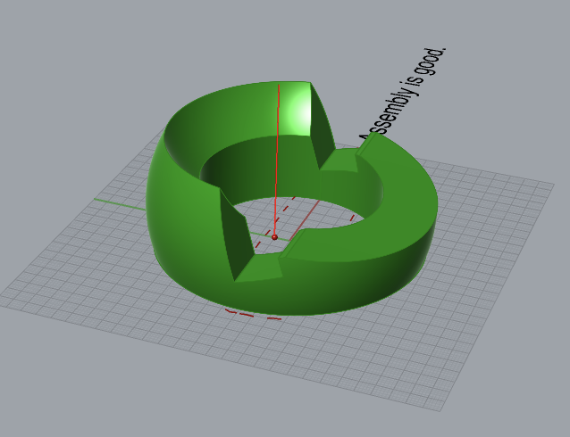</kbd> <kbd></kbd> <kbd>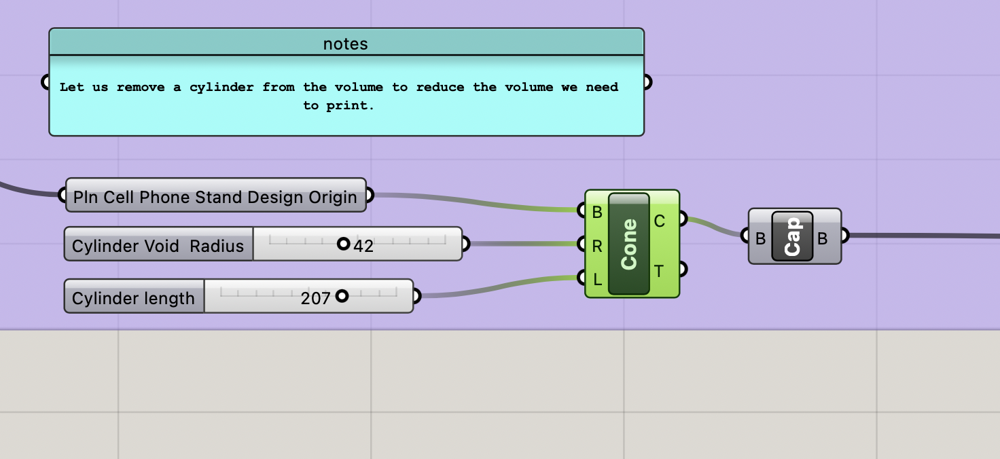</kbd>

Towards the end of the week, I experimented more with adding my own shapes, this time replacing the cylinder with a cube. I used TJ's video to follow along and make a new shape from scratch in Grasshopper, bring it into the existing Grasshopper file, and replace the cylinder section of the diagram with my own, plugging in variables where necessary. I think seeing the process from start to finish and him explaining each component as we moved along was extremely helpful to my understanding. 

<kbd>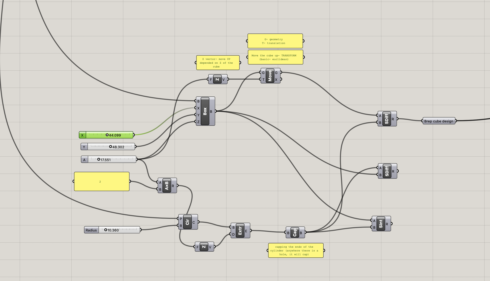</kbd>
<kbd>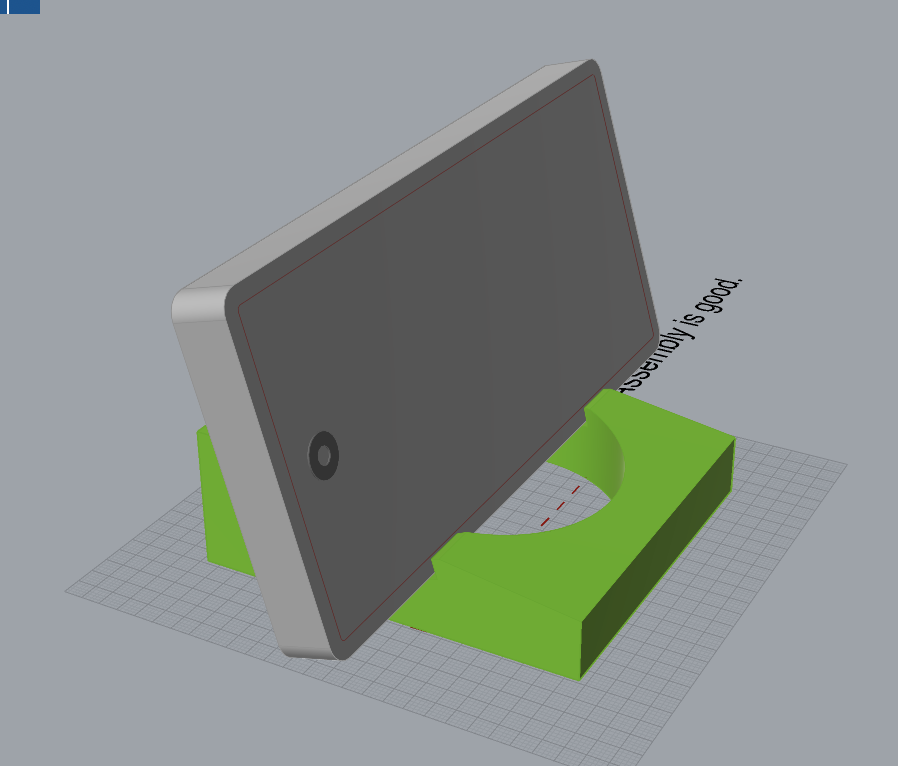 </kbd><kbd>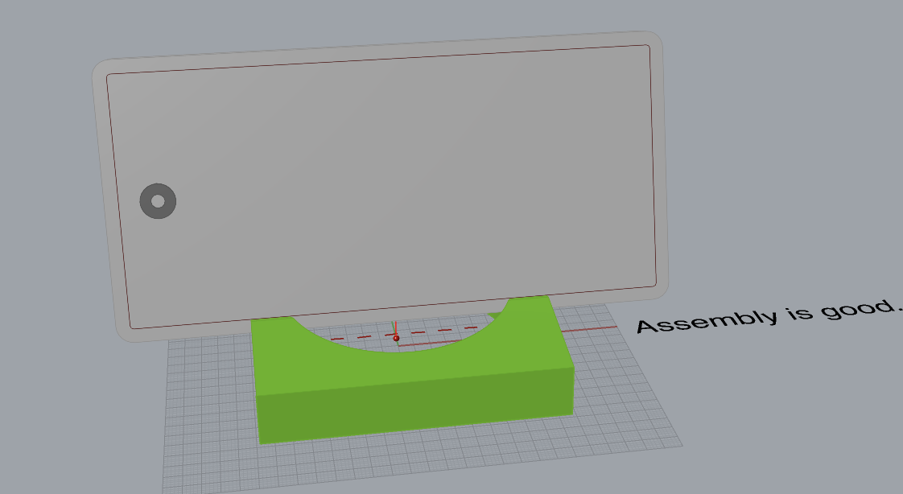 </kbd><kbd>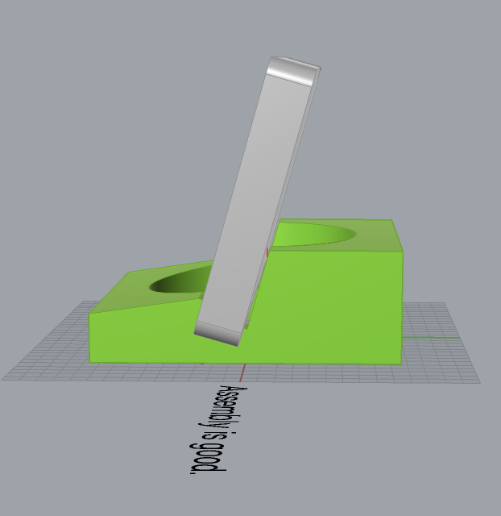</kbd>

I didn't realize before seeing TJ go through the process that the "clusters" are actually expanded into their own separate, extra grasshopper spaghetti sections. Almost like a grouping mechanism of some sort. As such, I'd probably update my mindmap to look more like this:

<kbd></kbd>

This time, adding a bit more detail and accounting for the fact that these clusters have their own separate logic going on behind the scenes. 

## :key: Key Learnings 
I had a couple main learnings so far for this week:
1. This is a WHOLE NEW way of understanding a design process that I typically have done in a very visual way. It is a more systematic and logic-based mode of creating models. In cases where testing must be done, and the parameters of what you're making are highly important, this is very useful.
2. Someone asked what the benefit of Grasshopper is vs. just making something directly in Rhino. In Grasshopper, you are able to directly change the parameters you use for your model. You can easily create sliders that allow you to manipulate various aspects. Additionally, it can be used to give feedback for testing purposes. In Rhino alone, this is not possible. 

## :telescope: Speculations
I think that this week had a huge learning curve overall. But it got me thinking about the future of design processes. More and more, I keep hearing about how we're headed away from designing individual products, and more towards designing SYSTEMS. This is a prime example. It is less useful to model a shape that you cannot effectively manipulate after the fact, or test to ensure that it is accomodating the specific user it is being designed for. At the end of the day, there are so many different types of users with their own separate needs- in a future where we are able to designed more customized experiences/ systems, this type of design is much needed. 

---

# Week 1 #
## :pushpin: 09/05/2024

I made a wooden laser-cut lantern out of plywood and cloth. I used a flower design and image traced it using Illustrator, cleaned up the spots where the design was not fitting together properly, and then measured out the lantern dimensions around this design. Here is my initial sketch and ideation for the project. 

<kbd>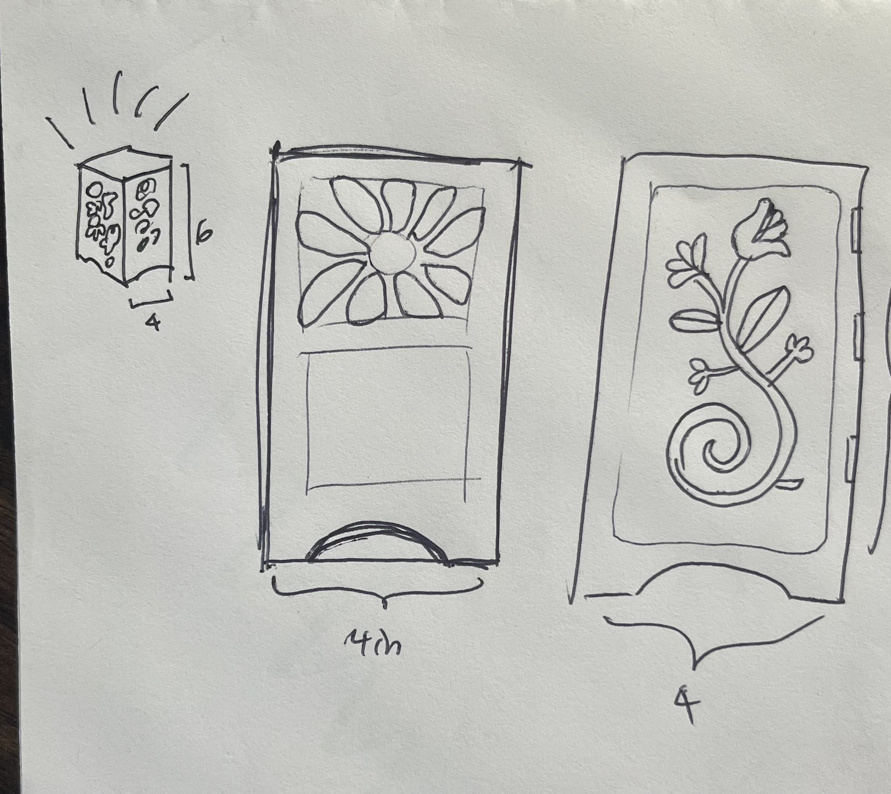 </kbd>

Here is the process of laser-cutting. I also took a picture of the pieces left behind after I removed my lantern- it looked super cool! I kind of wanted to reuse them for an art piece. 

<kbd></kbd> <kbd></kbd>

This was really fun. I ended up being able to get it cut exactly how I wanted on the first run-through, which was lucky. I know that some other students were having trouble with getting the laser to cut all the way through their material, with the vectors in the Illustrator file not being properly set up, etc. I'm grateful that I was able to get assistance from my classmate for this project and learn from the troubles he ran into, because it's been a while since I've used a laser cutter. I also have only ever cut arcylic, so using wood was a new experience for me. I also poked around in Rhino a bit this week, which was honestly a bit overwhelming. I have never used it before, and the last time I used a 3d modeling software (Fusion 360, for me) was several years ago. I'm excited to 3d print something down the line, though. I think there is a lot of utility in knowing how to model and print pieces and parts on your own. 

<kbd>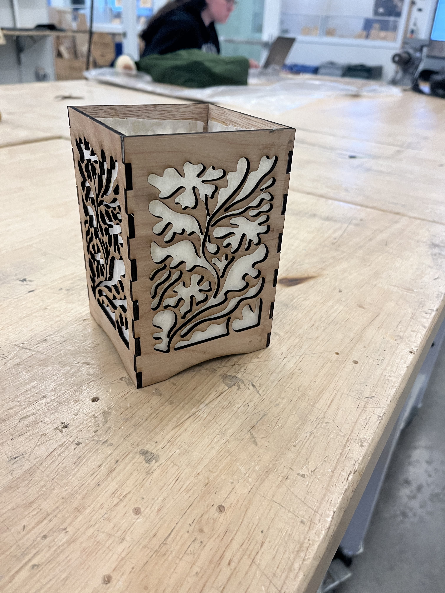</kbd>

## :key: Key Learnings 
In terms of learnings for this week, I'd say I have a few main things:
1. Don't plan your project timeline with the expectation of having it completed exactly how you want the first time. Build in time for extra iterations + mistakes/ unforseen circumstances.
2. Use your peers + classmates' expertise and knowledge to your advantage! Collaboration goes a long way and saves so much time when it comes to problem-solving.
3. Not everything has to be done from scratch- use the resources you have to create something cool! Finding inspiration for things that already exist is a great starting point.

## :telescope: Speculations
Here are some speculations for the future of my work based on this past week. Overall, I'm feeling really good about the way our cohort has worked together and helped each other out thus far. It's been cool to see people exchange ideas and give advice based on their own specific background, which made it super interesting to see how different disciplines started to overlap. I have a feeling we will continue to collaborate and give each other helpful insights going forward with the program. I think it would be cool to start experimenting with the emerging tools in the 3d space, such as AI to CAD and AR. Would be cool to add a digital/ interactive element to stuff we laser cut or 3d print that's unlocked and accessible from our mobile devices. 

